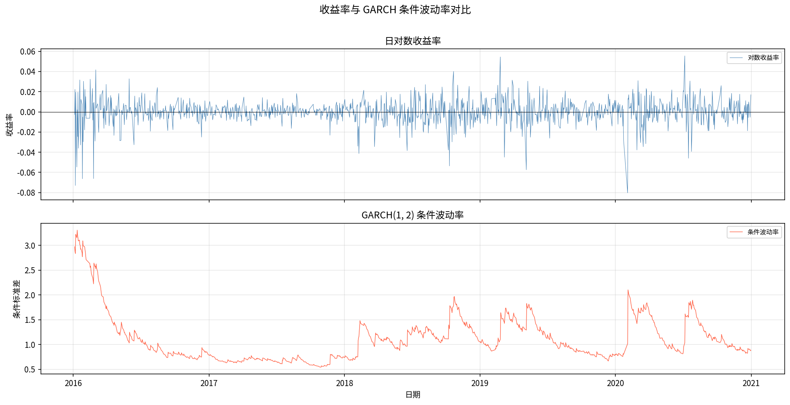

--------------------------------------------------------------------------------------------------------------------------------------------------------------------------------------

🔴 高优先级——技术硬伤，面试官会直接问

1. ARIMA(4,1,3) 未收敛（converged=False）

这是最明显的问题。候选模型 ARIMA(3,1,4) 已收敛且 AIC 仅差 5.5。应在 notebook 中明确做两模型对比，说明选择未收敛版本还是收敛版本，体现判断力。

2. GARCH(1,2) 残差 ARCH 效应未消除

标准化残差平方在滞后 1–3 显著（p<0.05），说明模型未完成任务。应补做 GJR-GARCH 对比——这是行业标准做法，也是最自然的"下一步"。只需：

 # arch 库直接支持
 model = arch_model(returns, vol='Garch', p=1, o=1, q=1)  # GJR-GARCH

3. 没有 GARCH 的样本外定量评估

ARIMA 有 MAE/RMSE/MAPE，GARCH 没有评估指标。应补充已实现波动率 vs 预测波动率的 RMSE（以 5 日滚动标准差作为 proxy）。没有 GARCH 评估指标，整个 GARCH 部分只有"拟合"没有"评估"。

4. 缺少 VaR 回测——这才是 GARCH 最核心的应用

GARCH 的工业用途 90% 是风险管理。增加 VaR 估计 + Kupiec 检验，一下子让项目从"学术练习"变成"有业务价值"：

 # 1% VaR: 用 GARCH 条件波动率 × 正态分位数
 var_1pct = -norm.ppf(0.01) * cond_vol
 # Kupiec 检验：breach rate vs nominal 1%

--------------------------------------------------------------------------------------------------------------------------------------------------------------------------------------

🟡 中优先级——加分项，体现深度

5. 测试覆盖不足

只有 preprocess 和基础 ARIMA 测试，没有 GARCH 测试。面试官看到 tests/ 目录会直接翻，应补充：

 - test_garch_model.py：prepare_returns、fit_garch 输出结构、持久性计算
 - 目前 34 个测试全是单元测试，可加 1 个轻量级的 pipeline 集成测试

6. 模型比较表缺失

当前只报告最优模型，没有候选模型的比较表。应在 notebook 里保留并展示 AIC 排行（已有 order_df，只需 display 出来）。模型选择过程可见才体现方法论严谨性。

7. EDA 用了完整 2000-2024 数据，但建模只用 2016-2020

这个决定没有任何解释。应在 notebook 或 README 里用 1–2 句说清楚原因（比如"避免 2015 股灾前后结构性断点影响"），否则读者会质疑数据集不一致。

8. 无滚动窗口回测框架

rolling_forecast_arima 已存在，但没有分时段评估（比如按年看 MAPE 趋势），这在量化方向面试中几乎必问。

--------------------------------------------------------------------------------------------------------------------------------------------------------------------------------------

🟢 低优先级——展示性加分，但非必须

9. README 缺少关键图片展示

README 里有图表列表但没有嵌入图片。加 2–3 张最重要的截图（收益率分布、条件波动率、样本外预测对比），GitHub 上第一眼印象差距极大：

 

10. 没有 evaluate.py 模块

所有评估指标（MAE、RMSE、MAPE、VaR breach rate）散落在 notebook cell 里。提取成 src/evaluate.py 可以：

 - 体现模块化设计能力
 - 让 report.py 能直接调用
 - 增加对应单元测试

11. data_loader.py 默认参数与 EDA notebook 实际用的数据不一致

EDA 用了 2000-2024 全量数据，但 load_train() 默认是 2016-2020。这个不一致需要对齐（给 EDA 单独一个 load_full_history() 函数，或 load_train 增加重载参数）。

--------------------------------------------------------------------------------------------------------------------------------------------------------------------------------------

📋 按求职方向的优先矩阵

┌───────────────────┬────────────┬────────────┬─────────────┐
│ 改进项            │ 量化研究员 │ 数据科学家 │ 风险/衍生品 │
├───────────────────┼────────────┼────────────┼─────────────┤
│ GJR-GARCH 对比    │ ⭐⭐⭐     │ ⭐⭐       │ ⭐⭐⭐      │
├───────────────────┼────────────┼────────────┼─────────────┤
│ VaR + Kupiec 检验 │ ⭐⭐       │ ⭐         │ ⭐⭐⭐      │
├───────────────────┼────────────┼────────────┼─────────────┤
│ GARCH 样本外评估  │ ⭐⭐⭐     │ ⭐⭐⭐     │ ⭐⭐        │
├───────────────────┼────────────┼────────────┼─────────────┤
│ ARIMA 收敛问题    │ ⭐⭐⭐     │ ⭐⭐       │ ⭐          │
├───────────────────┼────────────┼────────────┼─────────────┤
│ 补 GARCH 测试     │ ⭐         │ ⭐⭐⭐     │ ⭐          │
├───────────────────┼────────────┼────────────┼─────────────┤
│ README 嵌入图片   │ ⭐⭐       │ ⭐⭐       │ ⭐⭐        │
└───────────────────┴────────────┴────────────┴─────────────┘

最高投入产出比的三件事：① GJR-GARCH 对比 ② GARCH 样本外评估 ③ README 嵌图。这三项加起来不超过 1 天工作量，但项目展示效果质变。